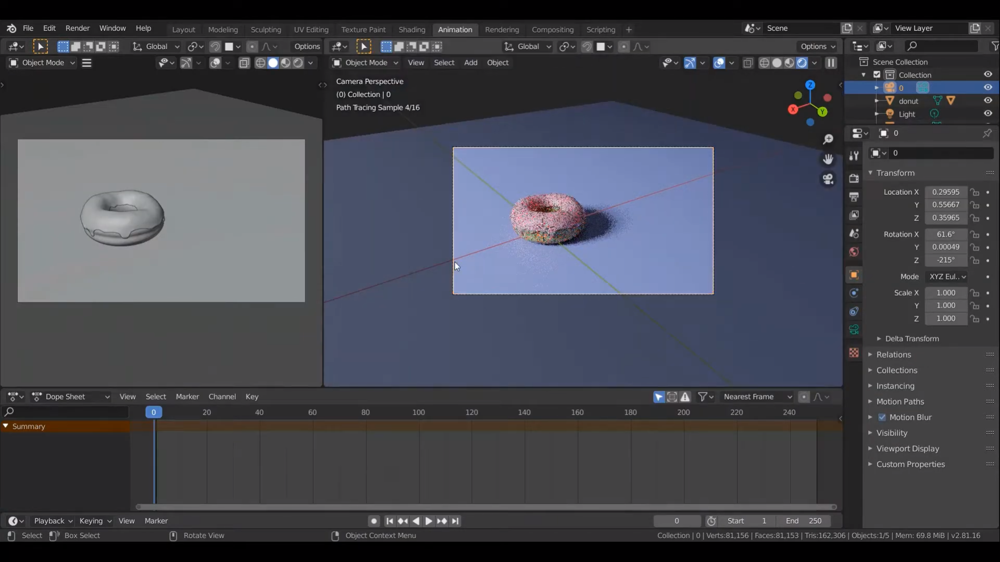

## Animation
Animation คือการนำเสนอ Object ในรูปแบบภาพเคลื่อนไหว โดยการ insert Keyframe ให้กับ Object

  
เลือก Active workspace เป็น Animation 

 

---------

 

  
จะแสดงหน้าต่าง 3D viewport เพิ่มขึ้นมาทางด้านซ้าย เป็นมุมมองของกล้องที่ตั้งไว้ และด้านล่างเป็น Dope Sheet สำหรับแก้ไข Keyframe

 

---------

 

  
เลือกที่ Object กด i การเลือก insert keyframe เป็น Location จะเป็นการกำหนดตำแหน่งของ Object ที่ Keyframe นั้นๆโดยในที่นี้เริ่มที่ Keyframe 0 เป็นตำแหน่งเริ่มต้นของ Object

 

---------

 

  
เลือกที่ Keyframe อื่นเช่น keyframe 20 จากนั้นเลื่อนตำแหน่งของ Object ไปที่ตำแหน่งอื่น เมื่อ insert keyframe Location ที่ keyframe 20 กด spacebar เป็นการแสดงภาพเคลื่อนไหว Object จะมีการเคลื่อนที่จากตำแหน่งแรกมาที่ตำแหน่งที่ Keyframe 20 กำหนดไว้ 

 

---------

 

  
 การ insert keyframe อื่นๆเช่น Rotation เป็นการกำหนดการหมุนที่เปลี่ยนไปของ Object ในแต่ละ Keyframe

 

---------

 

  
การ insert keyframe แบบ Scaling เป็นการกำหนดขนาดที่เปลี่ยนไปของ Object ในแต่ละ Keyframe

 

---------

 

[back](/CN409)
