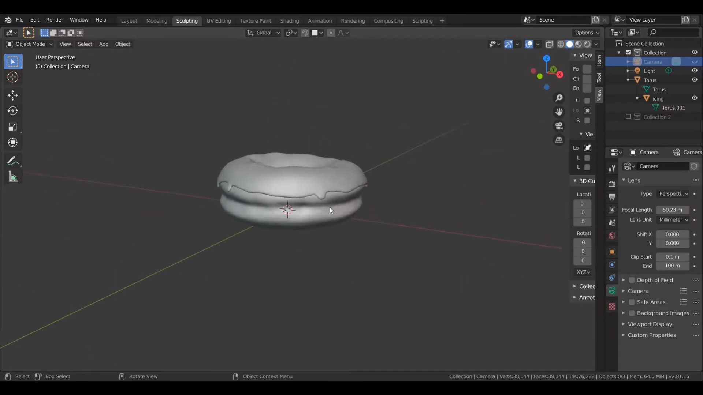
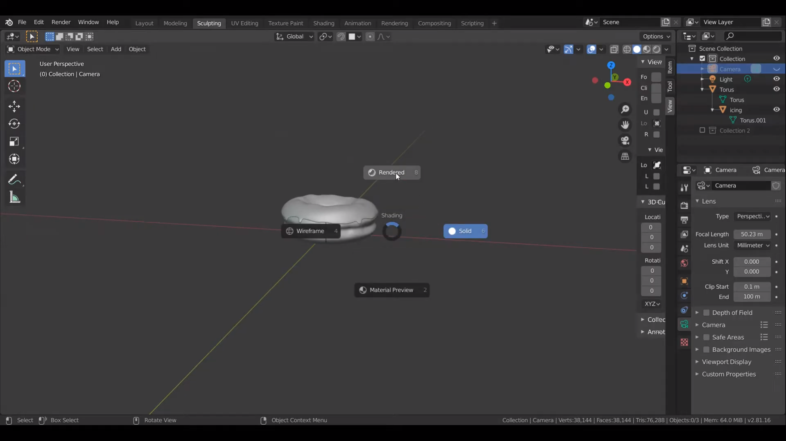
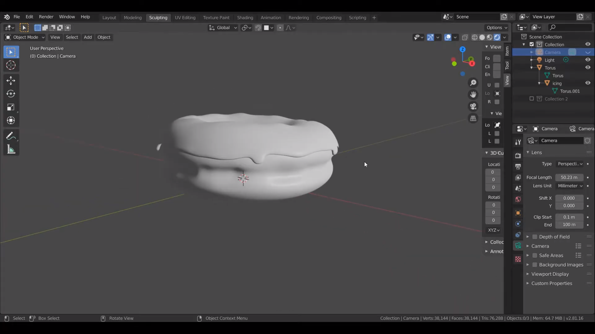
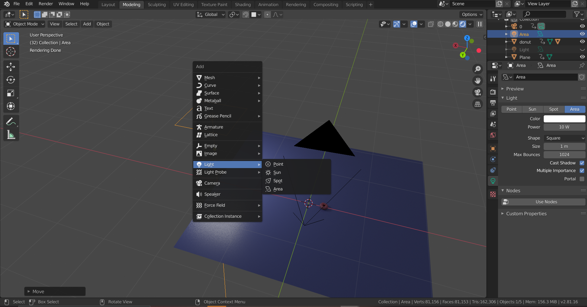
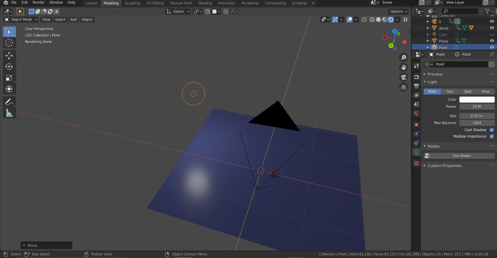
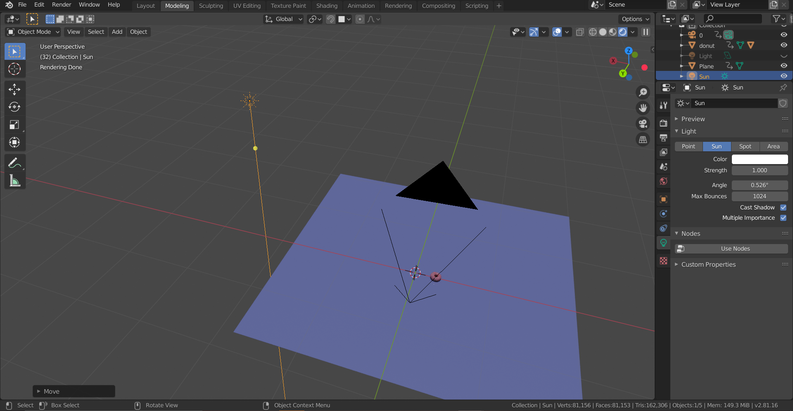
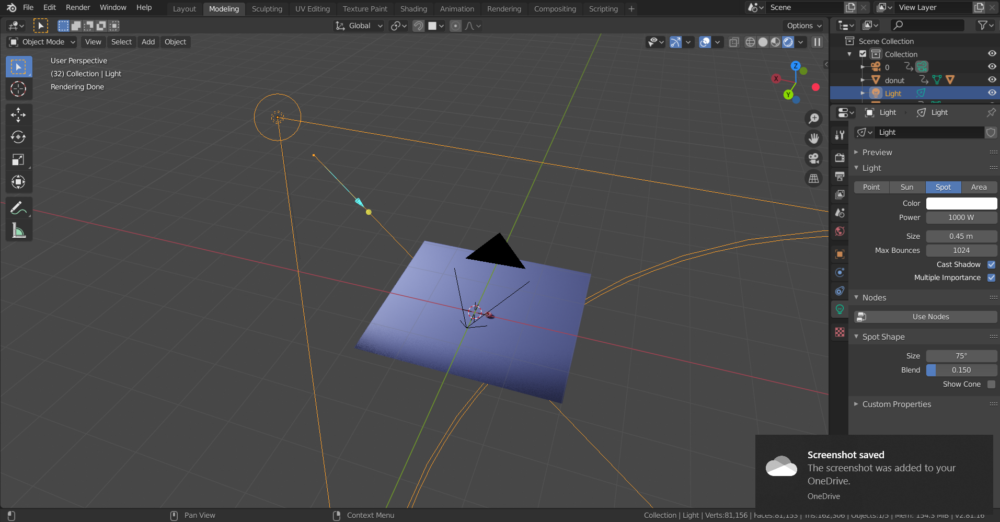
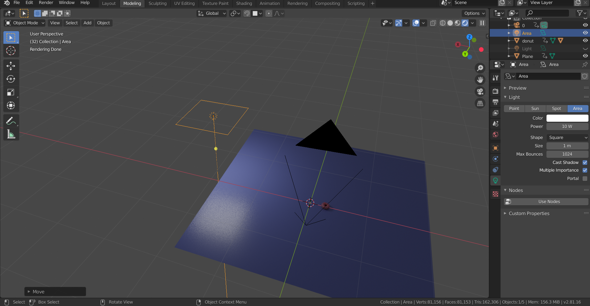

## Lighting
Lighting คือ แสงที่ให้ความสว่างและเงาให้สมจริงในโหมด Rendered

  
Object ในโหมด Solid จะไม่มีการใช้แสง

 

---------

 

  
กด z เลือกโหมด Rendered

 

---------

 

  
โหมดนี้จะเห็น Object แบบใช้แสงและเงาเข้ามาเกี่ยวข้อง

 

---------

 

  
การเพิ่ม Light กด Shift+A เลือก Light โดยจะมีแสงอยู่ 4 แบบ
1. Point
2. Sun 
3. Spot
4. Area

 

---------

 

  
Point จะเป็นแสงแบบจุดเหมือนหลอดไฟ สามารถปรับค่ากำลังไฟได้

 

---------

 

  
Sun แสงพระอาทิตย์ปรับกำลังไฟไม่ได้ แต่สามารถปรับความเข้มแสงได้

 

---------

 

  
Spot เป็นแสงที่มีมุมองศาเข้ามาเกี่ยวข้อง สามารถปรับค่ากำลังไฟได้

 

---------

 

  
Area เป็นแสงแบบแผ่นคล้ายจอ สามารถปรับรูปทรงได้เป็นแบบ Square, Rectangle, Disk, และ Ellipse 

 

----------

 

[back](/CN409/)
