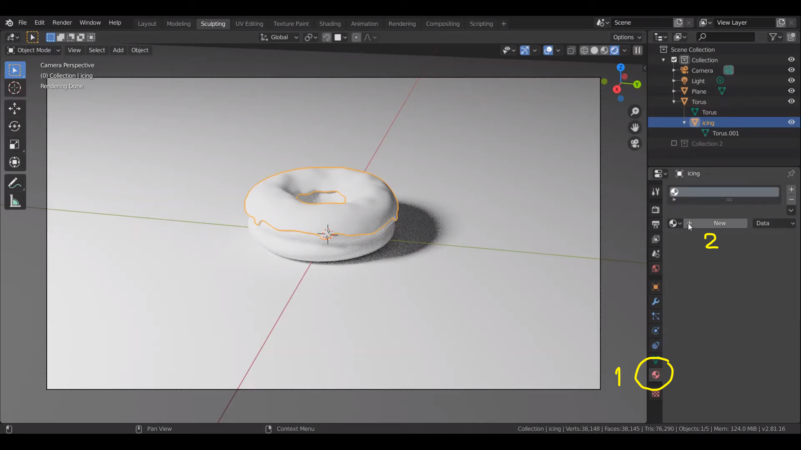
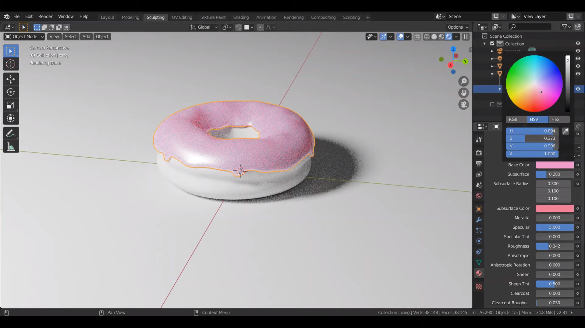
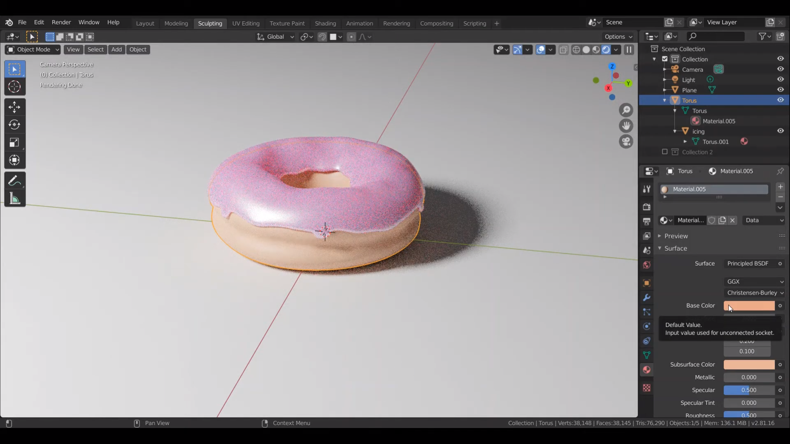
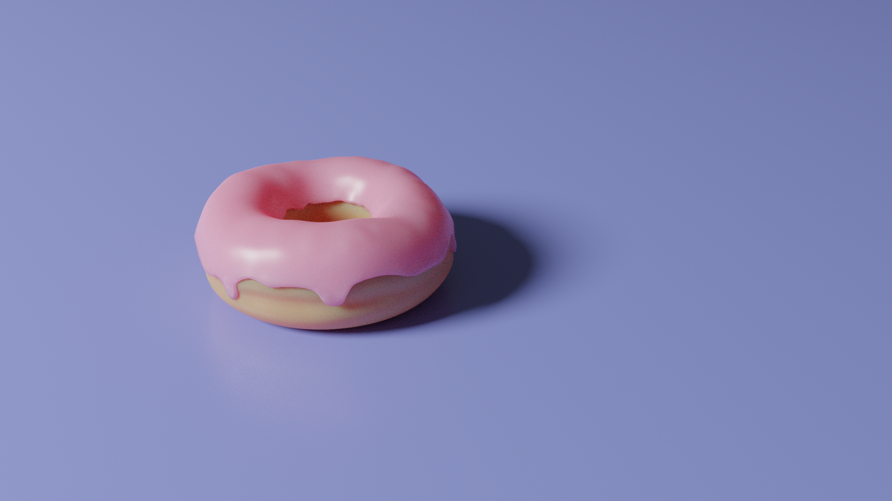

## Materials
Materials คือ ลักษณะของพื้นผิว Object

  
1. เลือกที่ Material Properties
2. กด New Material ให้กับ Object ที่เลือก

 

---------

 

  
ปรับแต่งสีของ Base color และค่าอื่นๆได้ เช่น
 Subsurface color เป็นสีสะท้อนของวัตถุเมื่อถูกแสง ค่าของ Roughness เป็นค่าความมันวาว/ด้าน ของวัตุ

 

---------

 

  
 

 

---------

 

  

 

---------

 

[back](/CN409/)
