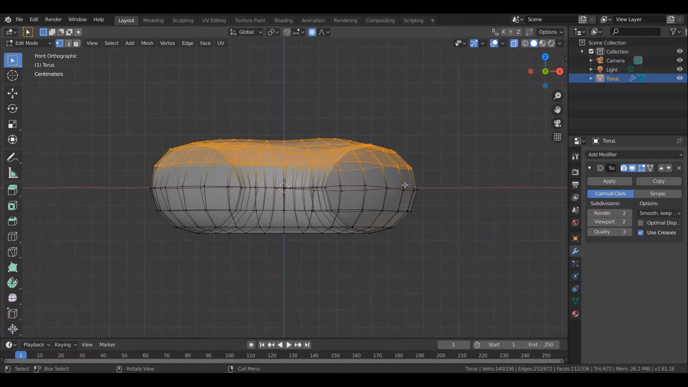

## Modeling
Modeling คือการสร้างงานในรูปแบบ 3D ด้วย Object ที่เป็นรูปทรงพื้นฐานที่มีมาให้ใน Blender 
 
  
การเพิ่ม Object พื้นฐานกด shift+A เลือก Mesh จะแสดงรูปทรงพื้นฐานต่างๆ 
รูปทรง Mesh หนึ่งๆจะประกอบไปด้วย 
1. vertex คือ จุด 
2. edge คือ เส้นที่ลากต่อจุด
3. surface คือ พื้นผิวที่ปิดล้อมด้วย edge

  
การปรับรูปทรงของ Object เลือกที่จุด vertex กด G จะเป็นการ move ตำแหน่งที่เลือก หากกด O ก่อนเพื่อให้การกด G move โดยรอบจุดที่เลือกด้วย
  
-----------

  
หากคลิกขวาที่ Object สามารถเลือกให้ Object แสดงผลแบบ Shade Smooth จะแสดงให้เห็น Object เรียบเนียน Shade Flat จะเป็นแบบแผ่นรอบต่อของ Surface 
  
-----------

  
การเพิ่ม Modifier ที่เป็น Subdivision Surface จะทำให้พื้นผิวของ Object มีความละเอียดขึ้นด้วยการเพิ่มค่า viewport
  
-----------
  
การเลือกคุม Object บางส่วนและให้ครอบคุมโดยรอบด้าน 360 องศาได้โดยใช้ X-Ray กด Alt+Z 
  
-----------

  
การ Duplicate Object ที่เลือกโดยการกด Shift+D กด esc หากไม่ต้องการย้ายตำแหน่ง จากนั้นกด P เป็นการ separate เลือก selection จะได้เป็นอีก Object แยกออกมา
  
-----------

  
การเพิ่ม Modifier ที่เป็น Solidify จะทำให้พื้นผิวของ Object ดูเป็นของแข็ง
  
-----------

  
การปรับแต่ง Object ที่จุดต่างๆโดยการ extrude เลือก vertex 2 จุดขึ้นไปกด E จะเป็นการเพิ่มพื้นผิว surface ใหม่
  
-----------

  
การปรับแต่ง Object ด้วยการใช้เครื่องมือ Sculpting
  
-----------
 
[back](/CN409/)
