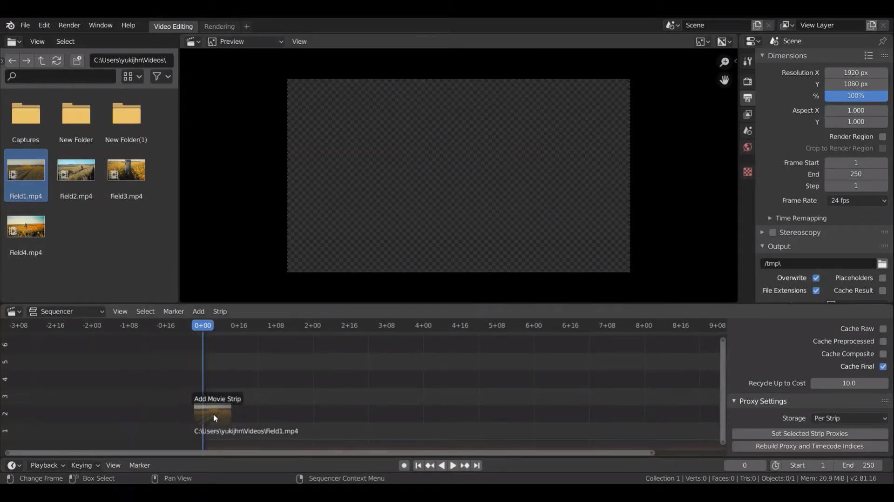
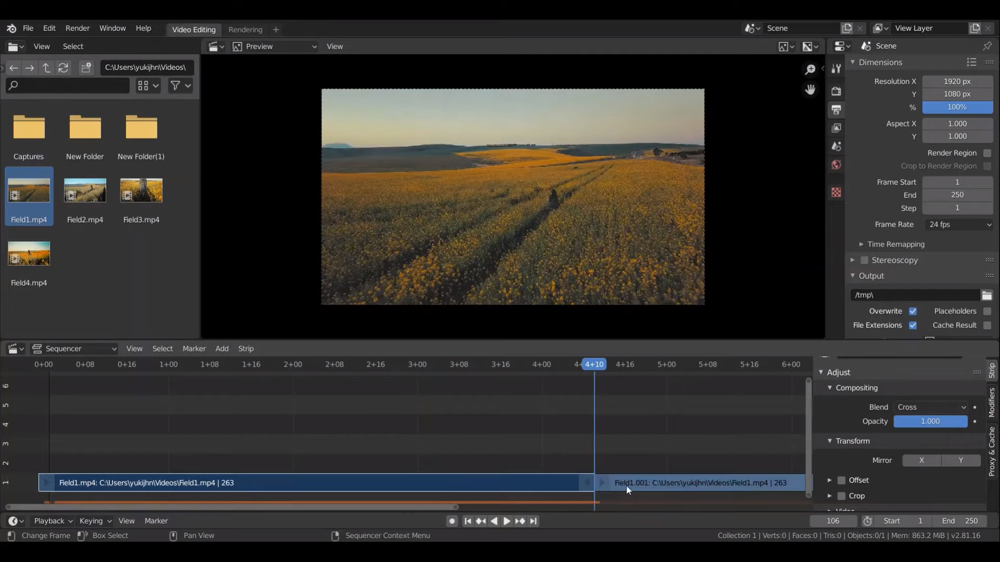
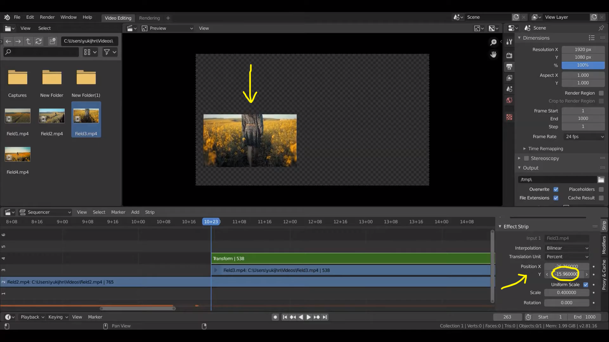

## Video Editing
Video Editing เป็นความสามารถหนึ่งของ Blender 2.8 ที่ช่วยในการตัดต่อคลิปวิดีโอ

  
เมื่อเปิด Blender ขึ้นมาเลือกที่ file > new > Video Editing

 

---------

 

  
จะได้หน้าต่างการทำงานดังภาพ สามารถลากวิดีโอที่ต้องการลงมาที่ Video Sequencer ได้เลย

 

---------

 

  
จะแสดงวิดีโอที่เลือกมาและแสดง Timeline ของคลิปวิดีโอ

 

---------

 

  
สามารถตัดคลิปด้วยการเลือก frame ที่จะตัดกด K จะได้คลิปแบ่งเป็น 2 อันสามารถย้ายแต่ละส่วนได้ กดลบได้ด้วยการกด X 

 

---------

 

  
เพิ่ม Effect ได้โดยการเลือกที่ Add > Effect Strip > Transform 

 

---------

 

  
สามารถปรับ Scale ได้ด้วยการเลือกที่ Uniform Scale

 

---------

 

  
การปรับ Position ตามแกน X จะขยับไปทางซ้ายหรือขวา

 

---------

 

  
การปรับ Position ตามแกน Y จะขยับไปด้านบนหรือล่าง

 

---------

 

  
การทำให้มองเห็นคลิปด้านล่างที่ซ้อนอยู่โดยการตั้งค่า Blend เป็น Alpha Over

 

---------

 

  
ก็จะเห็นคลิปที่ซ้อนอยู่ด้านล่างดังนี้

 

---------

 

  
การใส่ข้อความเลือก Add Text 

 

---------

 

  
เลื่อนตัวข้อความมาไว้ด้านบนคลิปเพื่อให้มองเห็น สามารถแก้ไขข้อความได้ที่ (1) และแก้ไขขนาดหรือแบบตัวอักษรและสีได้ที่ (2)

 

---------

 

  
สามารถเลือกว่าจะให้ข้อความแสดงนานแค่ไหนด้วยการยืดขยาย timeline ของข้อความ และสามารถเลื่อนตำแหน่งของข้อความตามแกน X Y ได้

 

---------

 

[back](/CN409/)
